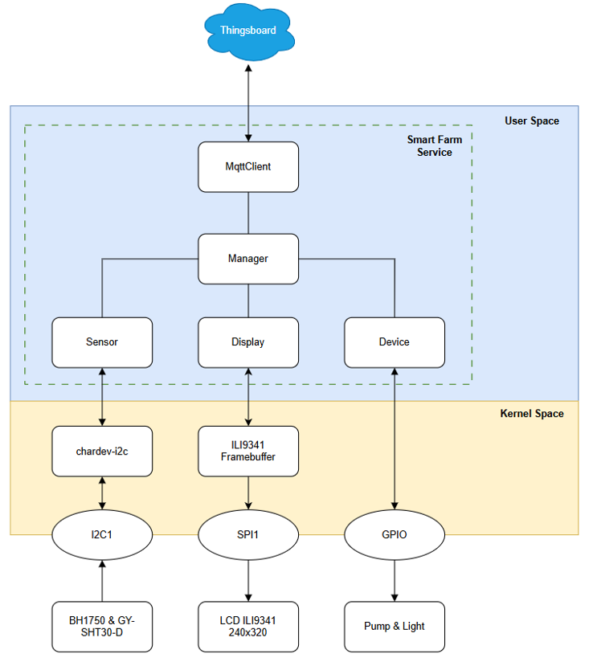

# Smart Farm – BeagleBone Black + Yocto

This project is a smart farming demo running on BeagleBone Black, built using Yocto Project. It features light and humidity sensing, an LCD display, and a custom Qt GUI.

## ⚙️ System Overview

- Board: BeagleBone Black
- Sensors: BH1750 (light), GY-SHT30-D (temp & humidity)
- Display: ILI9341 TFT LCD via SPI
- GUI: Qt for Embedded Linux
- Build System: Yocto Project (custom layer)

### System Architecture

---
### Software Architecture

---

## 🔧 Components

### 1. Sensor Drivers
- `bh1750.c` – Reads light intensity via I2C
- `sht30.c` – Reads temperature & humidity via I2C

### 2. Display Driver
- `ili9341_driver.c` – Controls the TFT LCD over SPI

### 3. Qt UI
- Building and Installing Qt SDK
- Using Qt SDK with Qt Creator

### 4. Yocto Integration
- Custom layer: `meta-openembedded/` `meta-qt5/`
- Bitbake recipe includes drivers and Qt app

---

